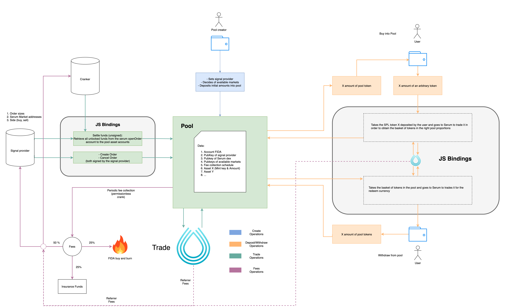

# bonfida-bot

### Structure:

- Program account data:
    - Vec of pool tokens accounts addresses (Vec of Pubkeys, owned by program)
    - Pool FIDA account address (Pubkey, owned by program)
    - Signal Provider address (Pubkey)

- Instructions:
    - Initialize Pool:
        - Signal Provider address (Pubkey)
        - Signed by Payer
    - Deposit(initializes the pool if its nonexistent):
        - Pool Seeds (256 bits)
        - Token Mint address (Pubkey)
        - Amount (u64)
        - Signed by Source and Payer
    - Redeem:
        - Pool Seeds (256 bits)
        - Amount of Pooltoken (u64)
        - Payout Token Mint address (Pubkey)
        - Payout Destination token address (Pubkey)
        - Signed by Pool-token owner and Payer
    - Trade (from signal):
        - Pool Seeds (256 bits)
        - Array of order amounts (array of u64)
        - Serum Market address (Pubkey?)
        - Buy/Sell (bool, buy = true)
        - Signed by Signal Provider and Payer

### Diagram:
